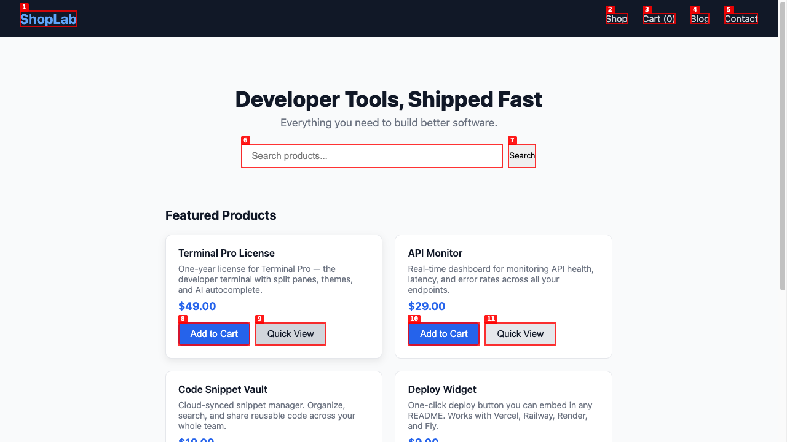
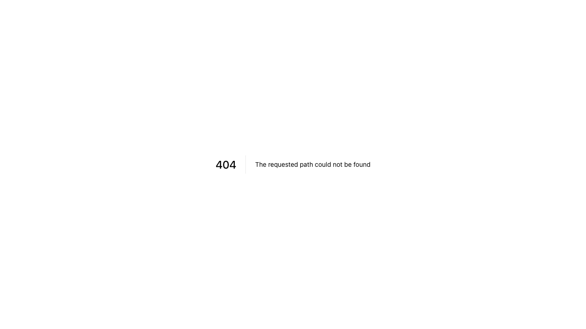
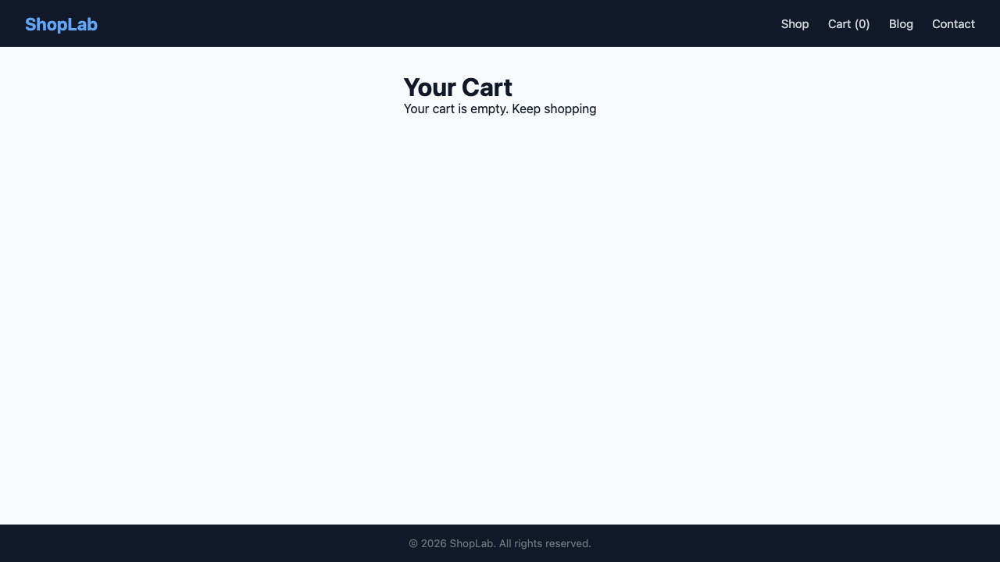
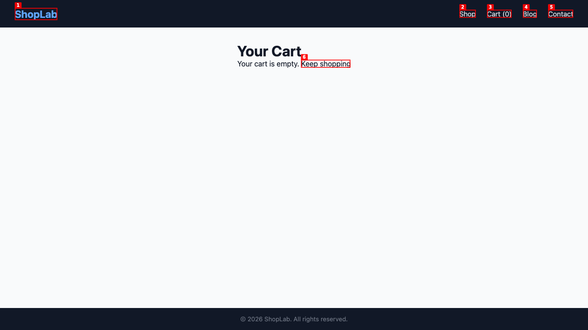
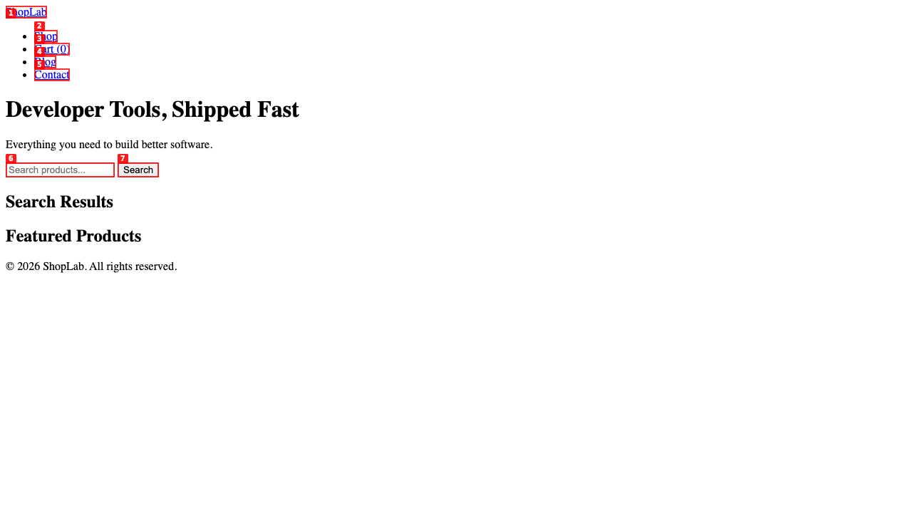

# Dogfood Report: localhost:3000/app

## Prompt

`/dogfood localhost:3000/app headed`

## Time

13m 47s

| Field | Value |
|-------|-------|
| **Date** | 2026-03-19 |
| **App URL** | http://localhost:3000/app |
| **Session** | localhost-3000 |
| **Scope** | Full app |

## Summary

| Severity | Count |
|----------|-------|
| Critical | 1 |
| High | 4 |
| Medium | 1 |
| Low | 0 |
| **Total** | **6** |

## Issues

---

### ISSUE-001: Search button does not filter products

| Field | Value |
|-------|-------|
| **Severity** | high |
| **Category** | functional |
| **URL** | http://localhost:3000/app/ |
| **Repro Video** | videos/issue-001-repro.webm |

**Description**

Typing a query in the search box and clicking "Search" has no effect. All products remain visible; no filtering or "Search Results" section appears. The search feature is completely non-functional.

**Repro Steps**

1. Navigate to `http://localhost:3000/app/`
   

2. Type "keyboard" in the search box
   

3. Click the **Search** button

4. **Observe:** All 6 products still show unchanged. No search results section. No filtering occurs.
   

---

### ISSUE-002: Quick View button does nothing (JS error: productModal is not defined)

| Field | Value |
|-------|-------|
| **Severity** | high |
| **Category** | functional / console |
| **URL** | http://localhost:3000/app/ |
| **Repro Video** | videos/issue-004-quickview.webm |

**Description**

Clicking any "Quick View" button on a product card produces no visible result — no modal, overlay, or detail view appears. The browser console shows `productModal is not defined`, indicating the JavaScript handler references a missing DOM element.

**Repro Steps**

1. Navigate to `http://localhost:3000/app/`
   

2. Click the **Quick View** button on the "Terminal Pro License" card

3. **Observe:** Nothing happens. No modal appears. Console logs `productModal is not defined`.
   

---

### ISSUE-003: Blog nav link returns a bare 404

| Field | Value |
|-------|-------|
| **Severity** | high |
| **Category** | functional |
| **URL** | http://localhost:3000/app/blog |
| **Repro Video** | N/A |

**Description**

Clicking "Blog" in the main navigation navigates to a page that returns a 404 error. The 404 page is a bare server error with no site navigation or branding — users are stranded with no way to return to the store.

**Repro Steps**

1. Navigate to `http://localhost:3000/app/`

2. Click **Blog** in the top navigation

3. **Observe:** A bare `404 | The requested path could not be found` page is shown. No site chrome or back navigation.
   

---

### ISSUE-004: "Proceed to Checkout" silently clears cart with no checkout flow

| Field | Value |
|-------|-------|
| **Severity** | critical |
| **Category** | functional |
| **URL** | http://localhost:3000/app/cart |
| **Repro Video** | videos/issue-006-checkout-v2.webm |

**Description**

Clicking "Proceed to Checkout" does not navigate to a checkout page. Instead, the cart is silently emptied, the user stays on the cart page showing "Your cart is empty", and a JS error `productModal is not defined` is logged to the console. No order confirmation, no payment flow — items are permanently lost.

**Repro Steps**

1. Navigate to `http://localhost:3000/app/` and click **Add to Cart** on any product. Cart counter shows `Cart (1)`.
   

2. Click **Cart (1)** in the nav to go to the cart page. Confirm the item is listed.

3. Click **Proceed to Checkout**

4. **Observe:** Cart is emptied (`Cart (0)`). Page shows "Your cart is empty." No checkout page appeared. Console error: `productModal is not defined`.
   

---

### ISSUE-005: App completely broken when URL lacks trailing slash (`/app` vs `/app/`)

| Field | Value |
|-------|-------|
| **Severity** | high |
| **Category** | functional / visual |
| **URL** | http://localhost:3000/app |
| **Repro Video** | N/A |

**Description**

Accessing the app at `http://localhost:3000/app` (no trailing slash) loads a broken version of the page: all CSS fails to apply (unstyled HTML), no products render, and a "Search Results" heading appears on page load with no search performed. The correctly-styled app only loads at `http://localhost:3000/app/` (with trailing slash). Any user sharing or bookmarking the URL without the trailing slash sees a completely broken experience.

**Repro Steps**

1. Navigate to `http://localhost:3000/app` (no trailing slash)

2. **Observe:** Page is completely unstyled (raw HTML), no product cards are shown, and a "Search Results" heading is visible before any search was performed.
   

3. Navigate to `http://localhost:3000/app/` (with trailing slash) — the page loads correctly with full CSS and all products.
   

---

### ISSUE-006: Multiple 404 errors in console (product images missing)

| Field | Value |
|-------|-------|
| **Severity** | medium |
| **Category** | console / visual |
| **URL** | http://localhost:3000/app/ |
| **Repro Video** | N/A |

**Description**

The browser console shows 7 failed resource requests (HTTP 404) on every page load of the app. Product cards display no images — only text and price. The missing images leave a blank space where product visuals should be, degrading the shopping experience.

**Repro Steps**

1. Navigate to `http://localhost:3000/app/`

2. Open browser DevTools → Console

3. **Observe:** 7 `Failed to load resource: 404 (Not Found)` errors. Product cards show no images.
   

---
