# Dogfood Report: localhost:3000/app

| Field | Value |
|-------|-------|
| **Date** | 2026-03-20 |
| **App URL** | http://localhost:3000/app/ |
| **Session** | localhost-3000 |
| **Scope** | Full app — nav links, search, cart, contact form, quick view, console errors |

## Summary

| Severity | Count |
|----------|-------|
| Critical | 1 |
| High | 4 |
| Medium | 1 |
| Low | 0 |
| **Total** | **6** |

## Issues

### ISSUE-001: Blog nav link returns 404

| Field | Value |
|-------|-------|
| **Severity** | high |
| **Category** | functional |
| **URL** | http://localhost:3000/app/ |
| **Repro Video** | videos/issue-001-repro.webm |

**Description**

Clicking the "Blog" link in the top navigation returns a 404 "The requested path could not be found" error. The Blog page does not exist. Users clicking this prominent nav link hit a dead end with no way back (the 404 page has no navigation).

**Repro Steps**

1. Navigate to http://localhost:3000/app/
   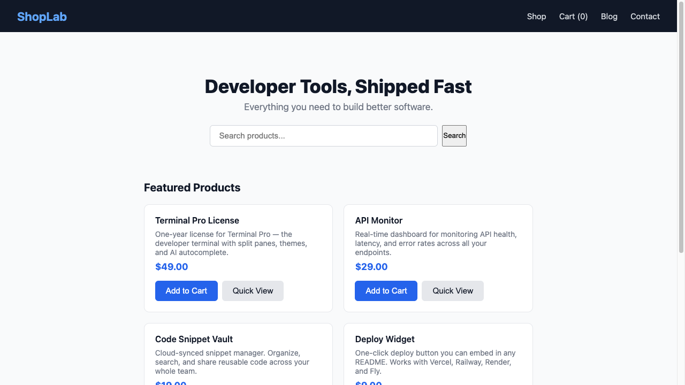

2. Click "Blog" in the top navigation bar
   

3. **Observe:** 404 error page is displayed — "The requested path could not be found"
   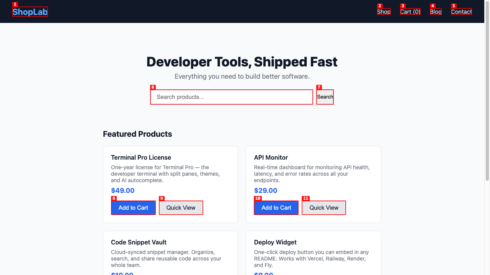

---

### ISSUE-003: Cart order summary totals do not update when quantity is changed

| Field | Value |
|-------|-------|
| **Severity** | critical |
| **Category** | functional |
| **URL** | http://localhost:3000/app/cart.html |
| **Repro Video** | videos/issue-003-repro.webm |

**Description**

When increasing item quantity in the cart, the per-row "Subtotal" cell updates correctly (e.g., 3 × $49.00 = $147.00), but the order summary section (Subtotal, Tax, Total) remains frozen at the original single-unit values ($49.00 / $3.92 / $52.92). A customer would be shown the wrong total before proceeding to checkout — they'd see $52.92 but should see $158.76 (3 × $49.00 + 8% tax).

**Repro Steps**

1. Navigate to http://localhost:3000/app/ and add "Terminal Pro License" ($49.00) to the cart
   

2. Navigate to the cart page — qty=1, row subtotal=$49.00, summary shows Subtotal $49.00 / Tax $3.92 / Total $52.92
   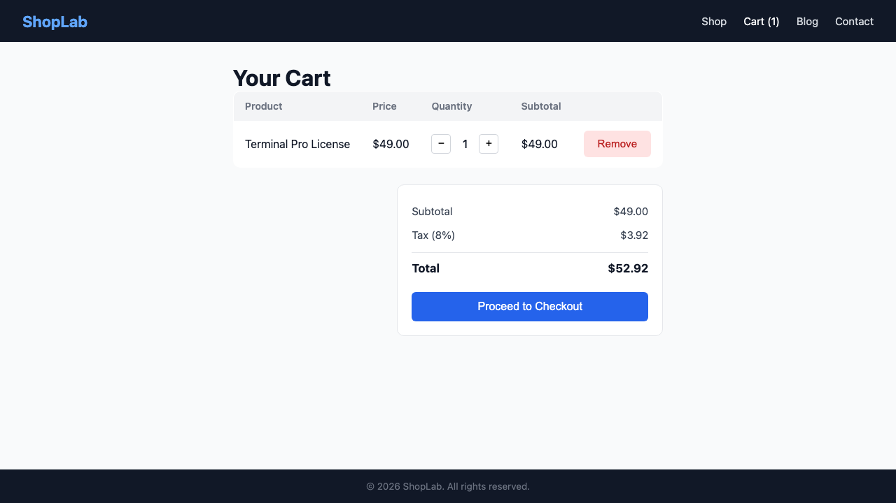

3. Click "+" twice to increase quantity to 3 — the row subtotal updates to $147.00 correctly
   

4. **Observe:** Summary section still shows Subtotal $49.00, Tax $3.92, Total $52.92 — NOT the expected $147.00 / $11.76 / $158.76
   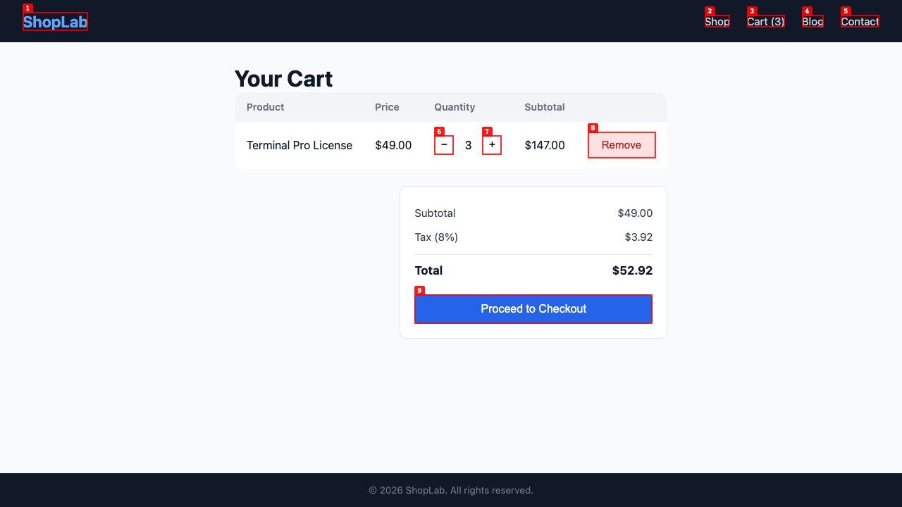

---

### ISSUE-004: Contact form shows no feedback after submission (success or error)

| Field | Value |
|-------|-------|
| **Severity** | high |
| **Category** | ux |
| **URL** | http://localhost:3000/app/contact.html |
| **Repro Video** | videos/issue-004-repro.webm |

**Description**

Submitting the contact form produces no visible feedback — no success message, no error message, no redirect. The form remains on screen with the entered values still in the fields, leaving the user unable to tell if their message was sent. Additionally, submitting with a blank "Message" field is accepted without any validation error, meaning required fields are not enforced.

**Repro Steps**

1. Navigate to http://localhost:3000/app/contact.html
   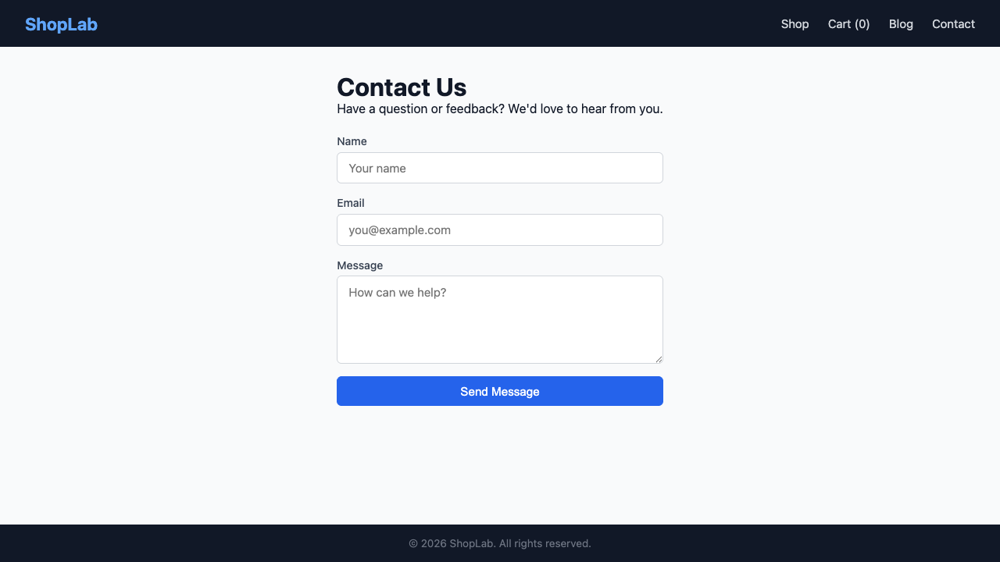

2. Fill in "Name" with "Jane Smith"
   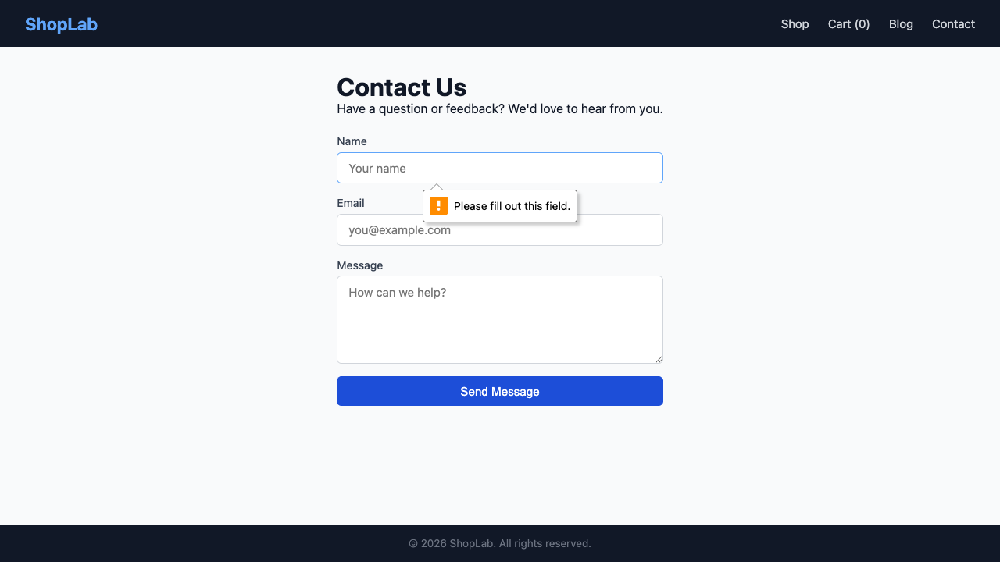

3. Fill in "Email" with "jane@example.com" — leave "Message" blank
   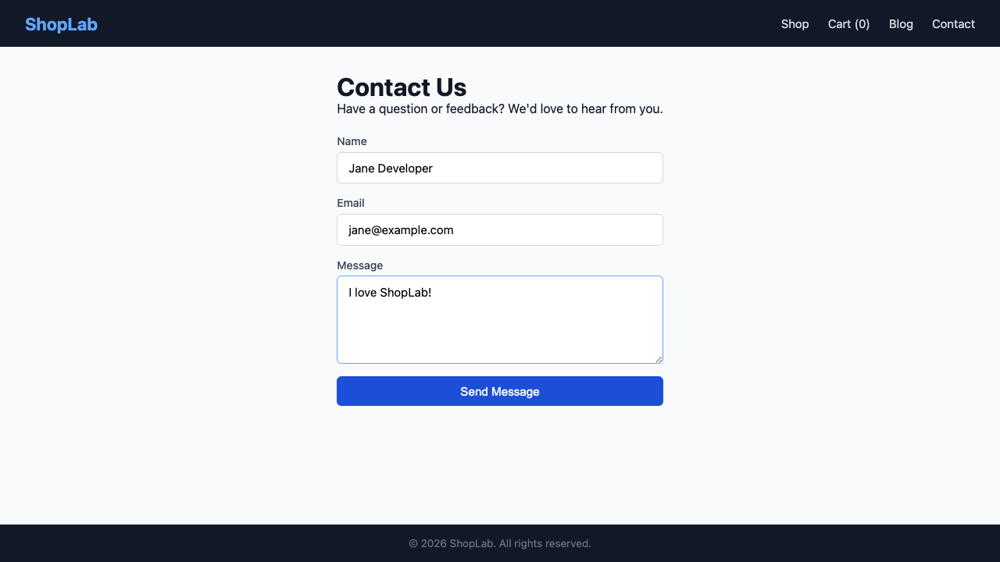

4. Click "Send Message"

5. **Observe:** No success/error message is shown. The form remains unchanged. No validation error for the empty Message field.
   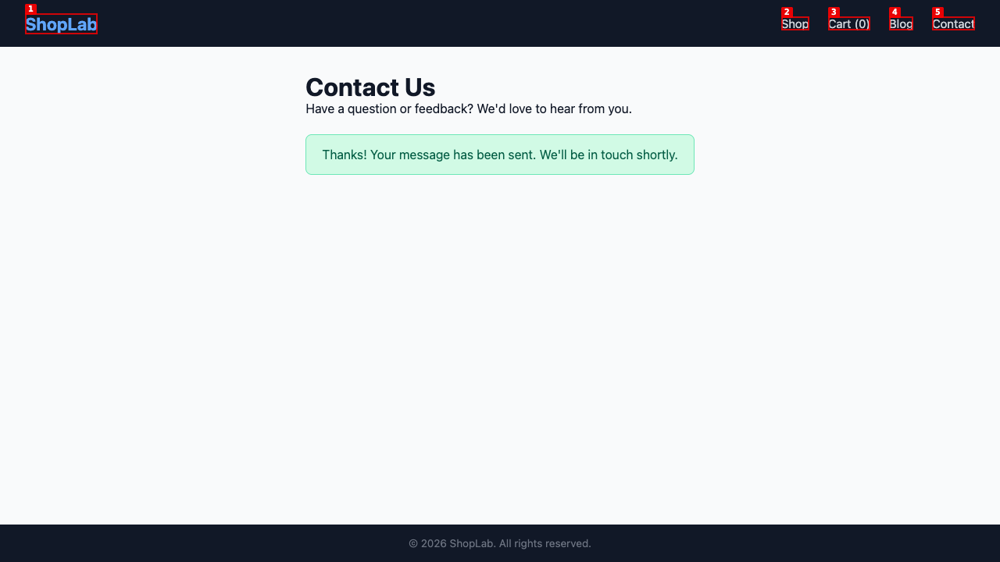

---

### ISSUE-002: Search returns no results for letter "a" despite all products matching

| Field | Value |
|-------|-------|
| **Severity** | high |
| **Category** | functional |
| **URL** | http://localhost:3000/app/ |
| **Repro Video** | videos/issue-002-repro.webm |

**Description**

Searching for the letter "a" returns "No results found." All 6 products in the store contain the letter "a" in their names (Terminal Pro **L**icense, **A**PI Monitor, Code Snippet V**a**ult, Deploy Widget, Error Tr**a**cker Bundle, Dev Sticker P**a**ck), so the search should return all of them. The search feature appears to be broken — it fails to match any products.

**Repro Steps**

1. Navigate to http://localhost:3000/app/
   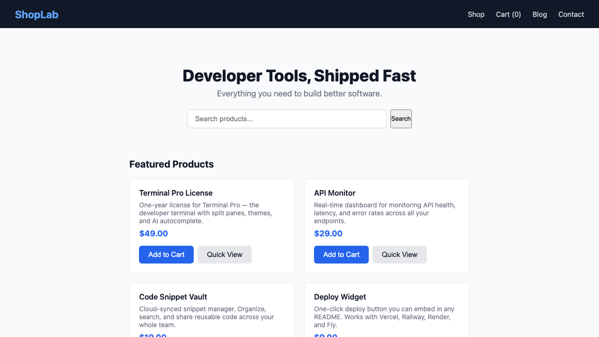

2. Type "a" into the search box ("Search products...")
   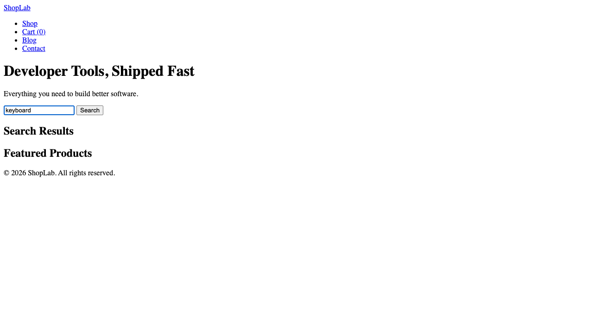

3. Click the "Search" button
   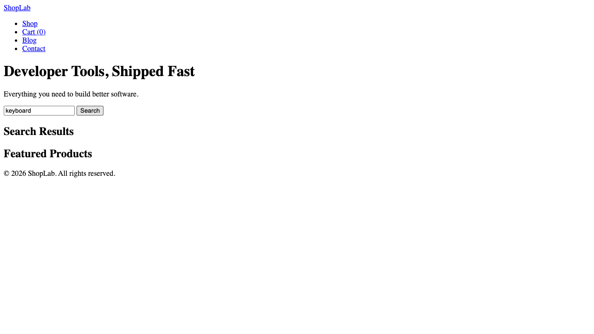

4. **Observe:** "No results found." is displayed under "Search Results" — all 6 products are still shown in "Featured Products" below, confirming products exist but the search returned nothing
   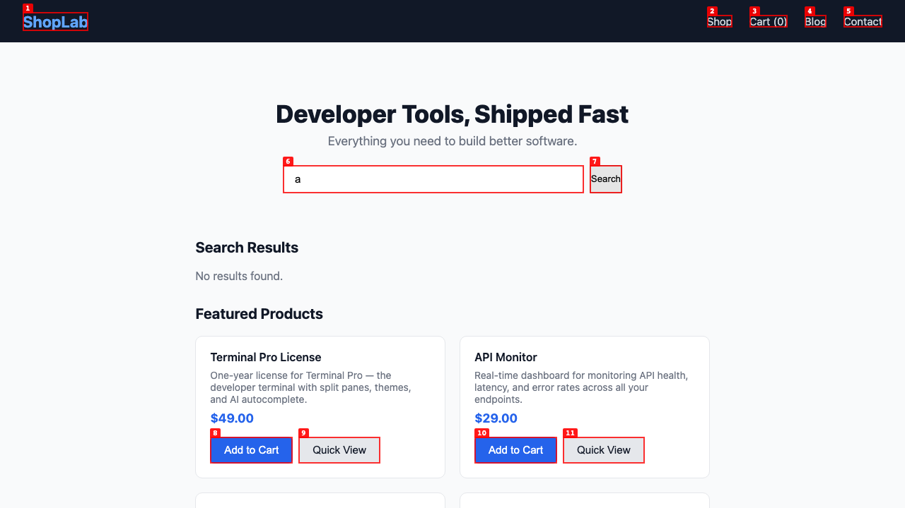

---

### ISSUE-005: Quick View button does nothing — JS error "productModal is not defined"

| Field | Value |
|-------|-------|
| **Severity** | high |
| **Category** | functional / console |
| **URL** | http://localhost:3000/app/ |
| **Repro Video** | videos/issue-005-repro.webm |

**Description**

Clicking any "Quick View" button on the home page produces no modal or product detail overlay. The browser console shows a JavaScript error: `productModal is not defined`. The feature is completely non-functional — the modal element is either missing from the DOM or the variable referencing it was never initialized.

**Repro Steps**

1. Navigate to http://localhost:3000/app/ — observe "Quick View" buttons on each product card
   

2. Click the "Quick View" button on the first product (Terminal Pro License)

3. **Observe:** No modal or overlay appears. The page is unchanged. Console shows: `productModal is not defined`
   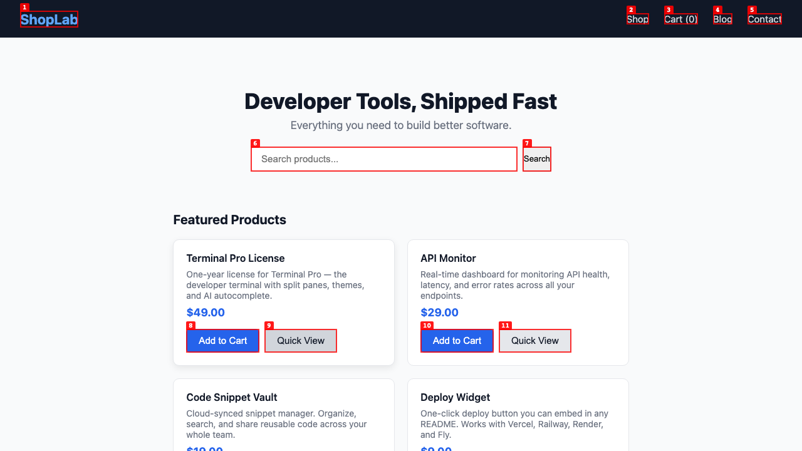

---

### ISSUE-006: Persistent 404 errors for resources on every page load

| Field | Value |
|-------|-------|
| **Severity** | medium |
| **Category** | console |
| **URL** | All pages (http://localhost:3000/app/*) |
| **Repro Video** | N/A |

**Description**

Every page load produces multiple `Failed to load resource: the server responded with a status of 404 (Not Found)` errors in the browser console. These appear consistently on all pages tested (home, cart, contact). The missing resources are likely CSS, JS, or image assets that the pages reference but the server cannot find. While the app visually appears functional, these errors indicate broken asset references that could degrade performance or cause missing functionality.

**Repro Steps**

1. Open browser console and navigate to http://localhost:3000/app/

2. **Observe:** Multiple 404 errors appear in the console for failed resource loads — present on every page visit
   

---

